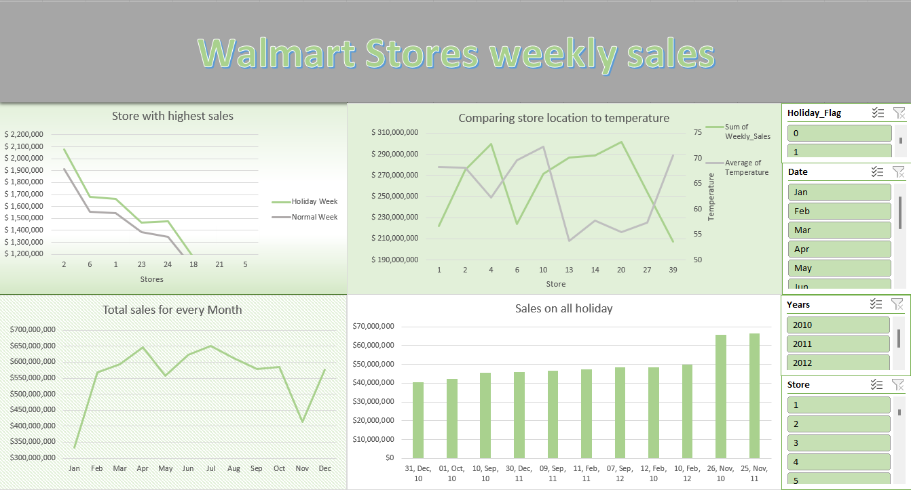

# Walmart Sales Dataset

This repository contains a dataset of weekly sales data from Walmart stores across various locations. The dataset provides insights into store performance, weekly sales figures, dates, and holiday flags, allowing for analysis of sales trends and the impact of holidays on sales.

## Dataset Overview

- **Filename:** Walmart_Store_sales.csv
- **Columns:** Store, Weekly Sales, Date, Holiday_Flag, temperature

## Dashboard

The dashboard provides a visual representation of key insights derived from the walmart dataset. It offers interactive charts to facilitate exploration and analysis of the data.

## Features

- **Store Performance:** The dataset includes weekly sales figures for individual Walmart stores, enabling analysis of store performance and comparison between different locations.
- **Sales Trends:** By examining weekly sales data over time, users can identify sales trends, seasonality patterns, and fluctuations in demand.
- **Holiday Impact:** The 'Holiday_Flag' column indicates whether a given week includes a holiday, providing insights into the impact of holidays on sales volume.

## Usage

Feel free to utilize this dataset for various purposes, including sales forecasting, trend analysis, and retail market research. Some potential applications include:
- Analyzing sales performance across different Walmart stores.
- Identifying seasonal sales patterns and forecasting future sales trends.
- Assessing the impact of holidays on sales and adjusting marketing strategies accordingly.

## Contribution

If you find any errors or inconsistencies in the dataset or wish to contribute additional data, feel free to submit a pull request.

## Acknowledgments

- Special thanks to Walmart for providing the sales data used in this dataset.
- Image credit: [spiceworks](https://images.spiceworks.com) for the cover photo.
